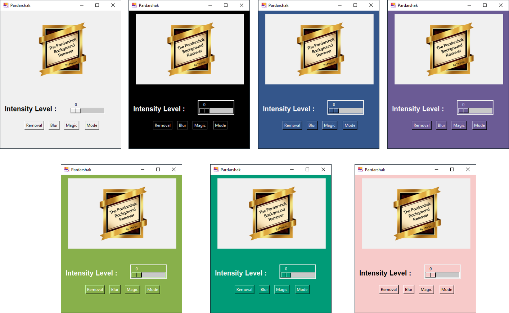
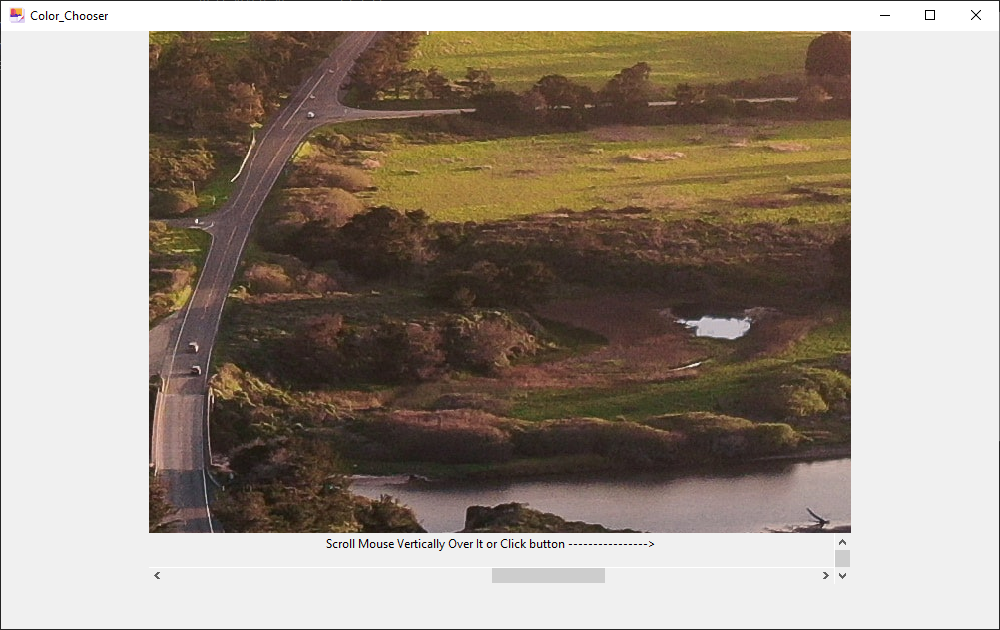

# This is the pardarshak background remover.

### It is free to use.

### Features:
#####   -Converts any type image to png with transparent color which was selected.
#####   -User can set different intensity to get required results.
#####   -one stop saved location.

### How to use:
#####   -Select the required intensity (range for the color you will select) . if the image contains the color in big area without big color change setting the intensity to 0 is         recommended. 
#####   -choose the image from computer.
#####   -the selected image will open select the color you wanna remove.
#####   -wait for sometime after loading it will automatically save the converted image to "Saved" name folder on the same place the exe file.
#####   -it might show "Not responding" or take a minute or two if the image selected is big or have high resolution.

### App Look:

### Now with the version 6 in new 7 themes :
   
   
### Window For selecting a pixel color:
   

## What is new in Version 6:

### 1. Blazingly Faster in removing background than version 1 and 2.
### 2. Now a new feature for blurring a image.
### 3. Now with 7 beautiful different themes.
### 4. Now with an Experimental Magic button.
### 5. Ability to choose any pixel from whole image.
### 6. New Style Logo.

